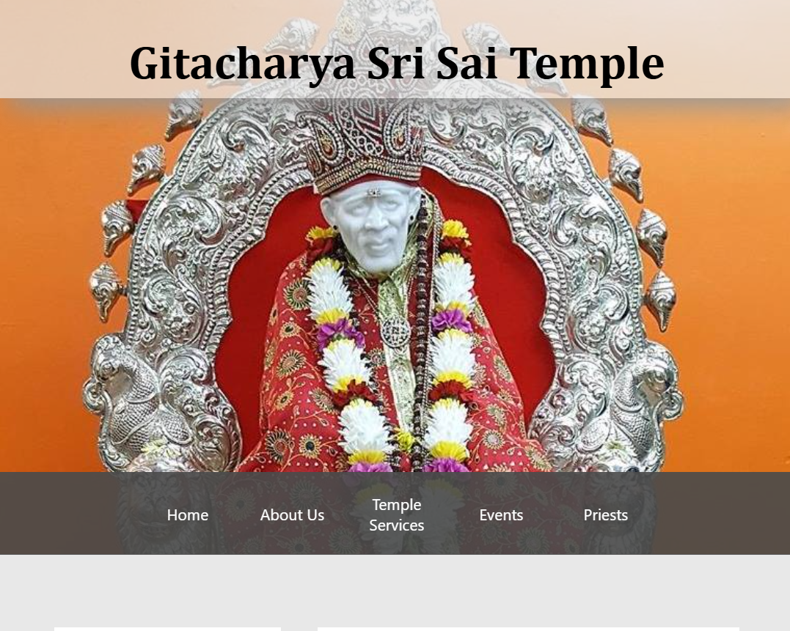
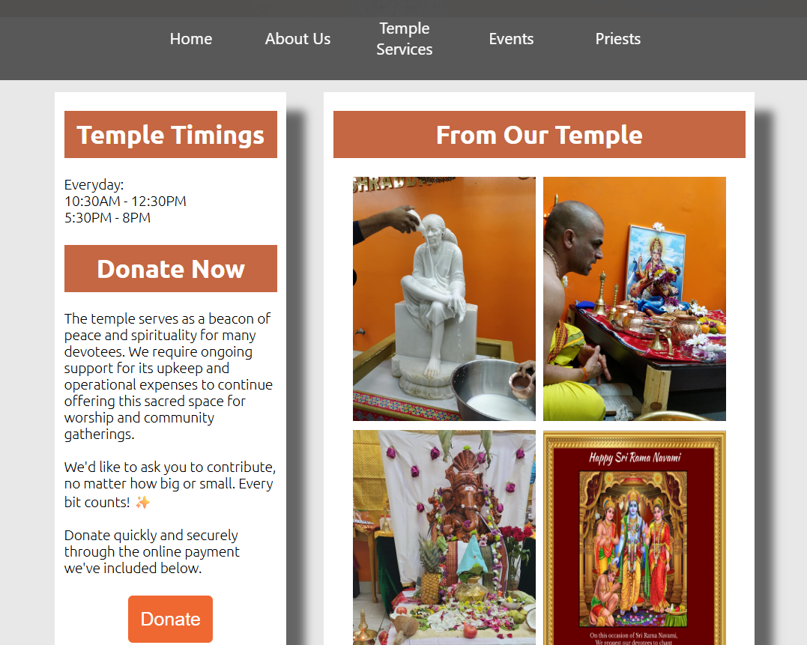
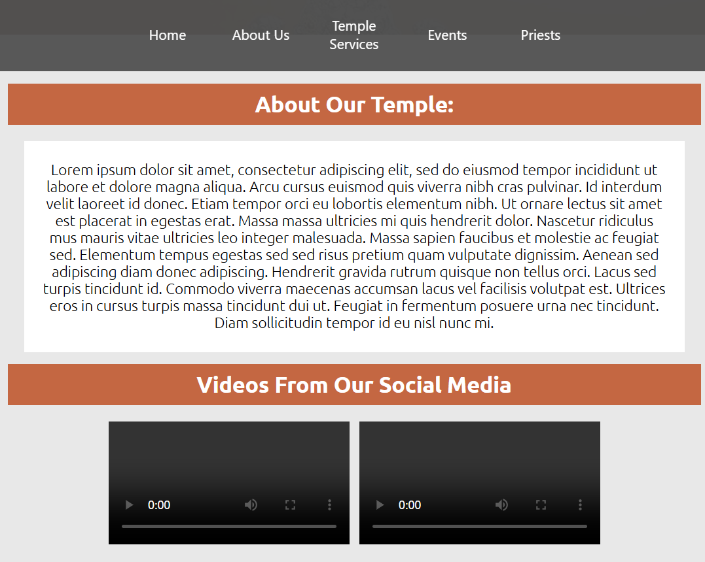
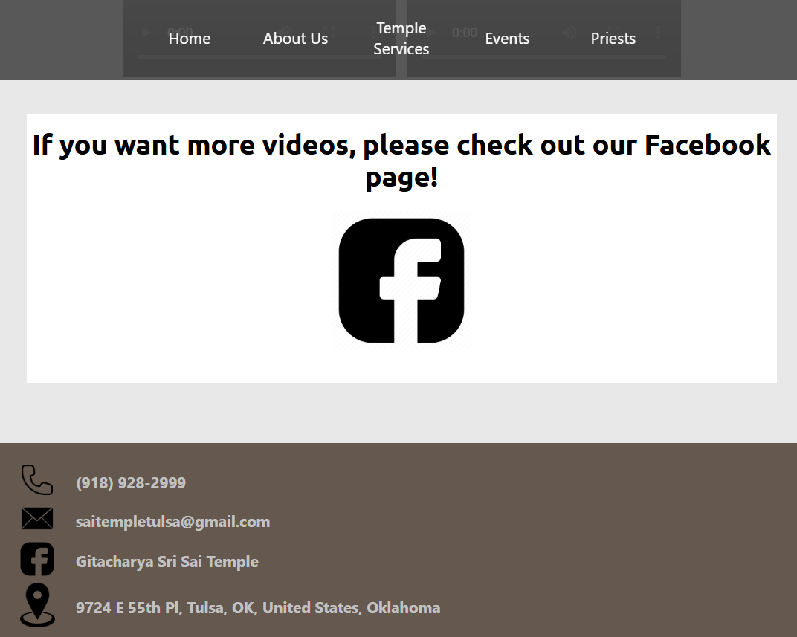
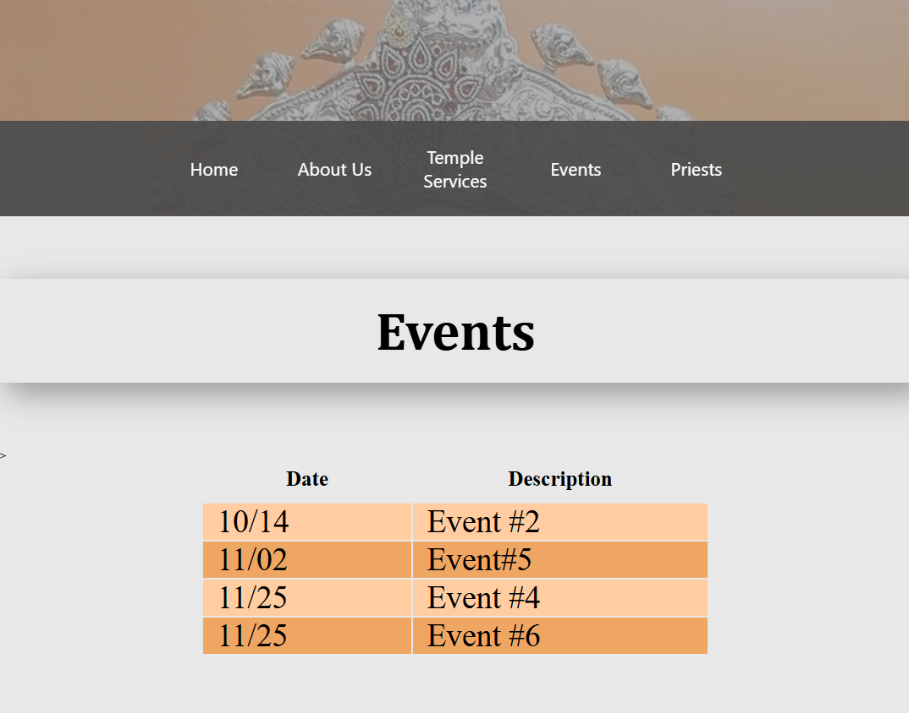
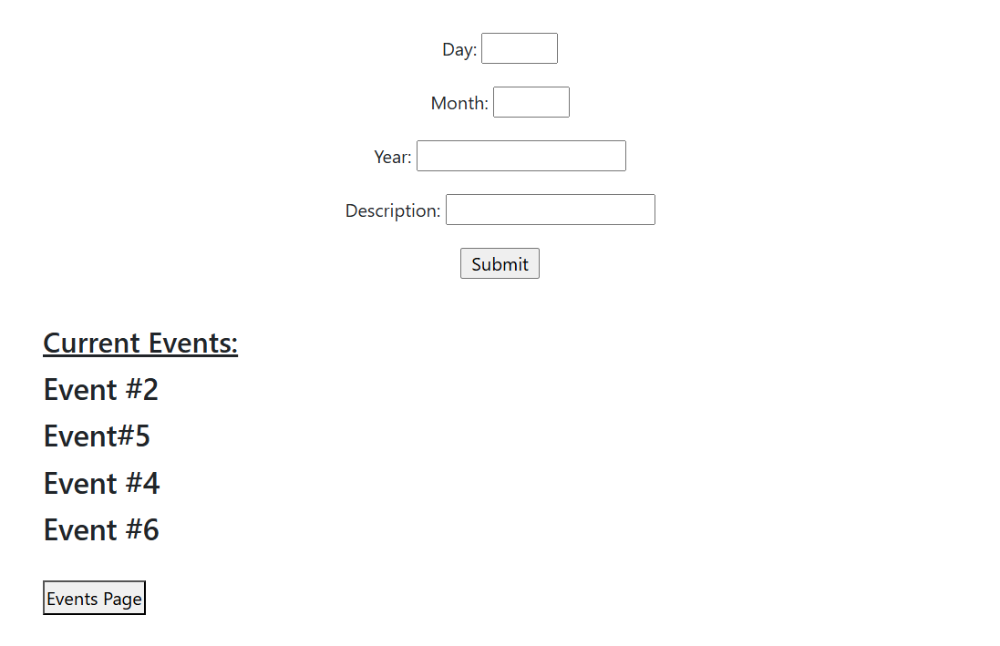
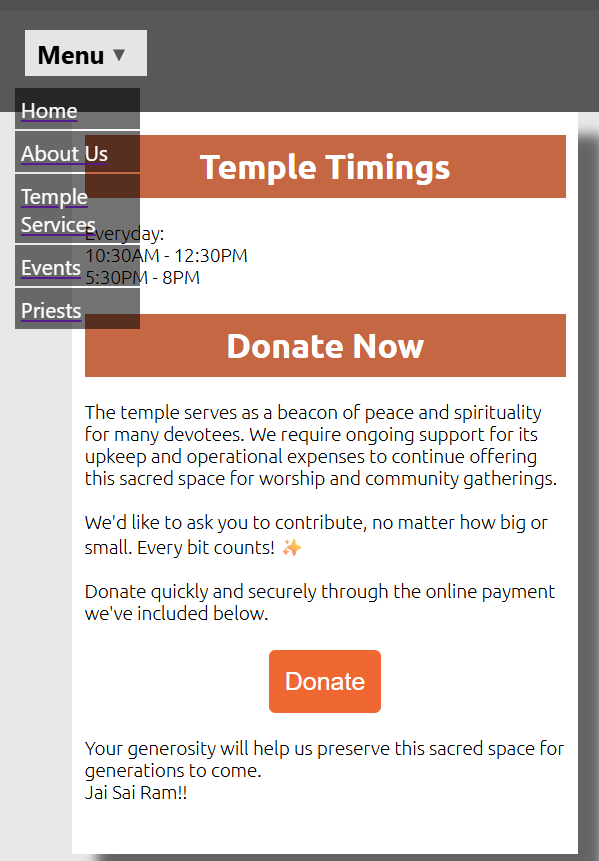

Temple website connected to MongoDB for storing and updating temple events.

Demo Video (https://youtu.be/Z4-n8ioOBgo)

## Images
### Home Page
| Home Page Img | Home Page Img |
|-----------|------------|
|  |  |
### About Us Page
| About Us Img | About Us Img |
|-----------|------------|
|  |  |
### Temple Services Page
| Temple Services Img | Temple Services Img |
|-----------|------------|
|  |  |
### Events / Add Events Pages
| Events Img | Add Events Img |
|-----------|------------|
|  |  |
### Responsive Design for Phone

## Features 
- View temple timings, values, services, events, and stay connected to temple's socials
- Dynamic event management 
- Responsive design depending on screen size

##  API Endpoints
| Route | Method | Description |
|--------|---------|-------------|
| `/` | GET | home page |
| `/about-us` | GET | about us page |
| `/temple-services` | GET | temple services page |
| `/priests` | GET | priests page |
| `/events` | GET | Retrieve all temple events |
| `/add-events` | POST | Add a new event |
| `/add-events/:description` | DELETE | Delete an event by its description |

## Tech-stack
- Frontend: HTML, CSS, JavaScript (or React, etc.)
- Backend: Node.js, Express.js
- Database: MongoDB

